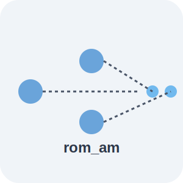

# ROM_AM

 

<p align="center">

</p>


-------------------------------------------------------------------------------------

 install with 
 
 ```
 pip install .
 ```

 Tested on Windows 10, Ubuntu 20.04 and mac 12.0. Python 3.8 and 3.9


