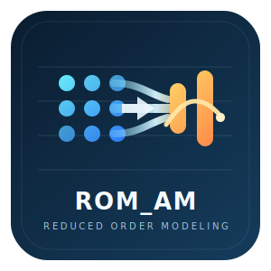

# ROM_AM

 <!-- Python versions supported -->


<!-- Last commit -->
 <!-- Open issues -->


<!-- Stars -->


<!-- License -->
 <!-- DOI (if published on Zenodo) -->
[](https://doi.org/10.1016/j.cpc.2025.109522)

<p align="center">

</p>


-------------------------------------------------------------------------------------

## Installation

### Quick Install

```bash
pip install .
```

**Tested on:** Windows 10, Ubuntu 20.04, and macOS 12.0+  
**Python versions:** 3.8, 3.9 and 3.13

### Example Data Files (Optional)

This repository keeps the example notebooks in git, while large data files are hosted separately on **Zenodo**.

If you only want the code and notebooks, a filtered clone is recommended:

```bash
git clone --filter=blob:none --single-branch https://github.com/azzeddinetiba/ROM_AM.git
```

You can also use a shallow clone if you only need the latest state:

```bash
git clone --depth 1 https://github.com/azzeddinetiba/ROM_AM.git
```

**Notes:**

- Jupyter notebooks (`.ipynb`) are kept in this repository
- Large datasets are intended to be downloaded separately from Zenodo (coming soon)
- If you only want to browse or read the notebooks, no dataset download is needed


